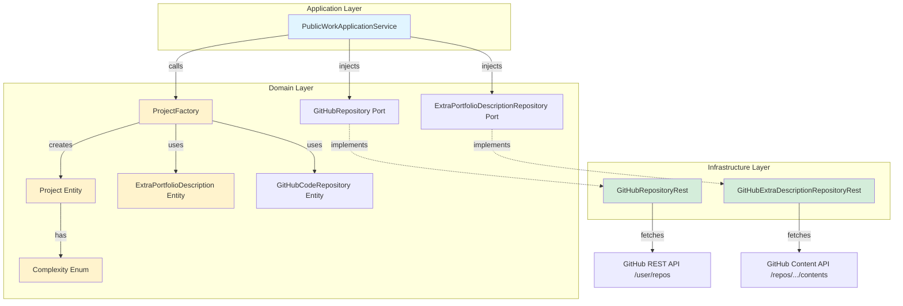
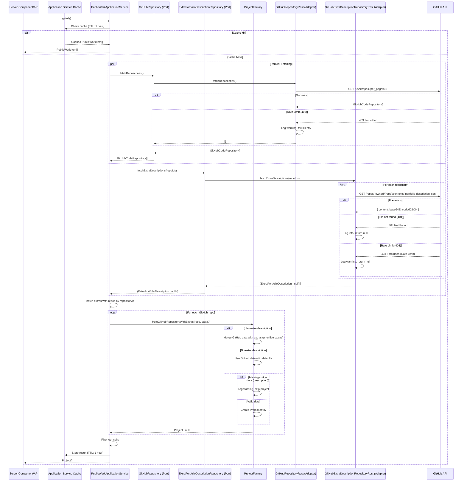
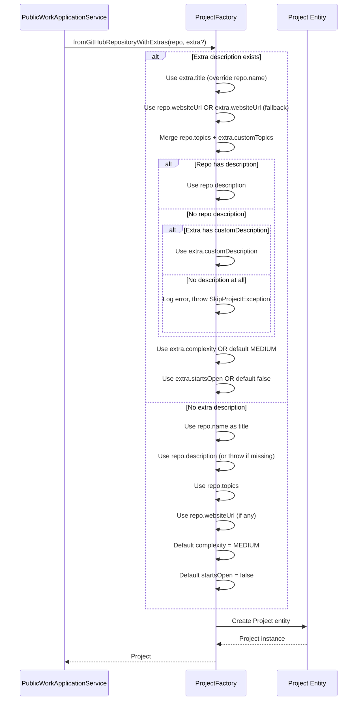

# ADR 2026-01-16 - Enhanced ProjectFactory with GitHub Extra Portfolio Descriptions

## 1. Title and Metadata

**Story ID**: Technical Improvement - Port Enhanced ProjectFactory Logic from v1  
**Title**: Implement Enhanced ProjectFactory with Extra Portfolio Descriptions Support  
**Status**: 🟡 Proposed  
**Date**: 2026-01-16  
**Decision Makers**: @bagnascojhoel  
**Related Features**: PublicWorkApplicationService, GitHubRepositoryRest

---

## 📋 FEATURE ANALYSIS

**Story**: Port Java implementation from website-v1 to TypeScript/Node.js  
**Type**: Technical Improvement - Domain Logic Enhancement

**Functional Requirements**:

- ✅ Fetch GitHub repositories with enriched metadata
- ✅ Support custom project descriptions via `.portfolio-description.json` files in each repository
- ✅ Merge GitHub repository data with optional extra descriptions (title, description, topics, website, complexity, startsOpen)
- ✅ Filter archived repositories unless explicitly enabled via `showEvenArchived` flag
- ✅ Provide default values for missing fields (complexity, startsOpen)
- ✅ Gracefully skip projects with missing critical data (description)

**UI/UX Requirements Identified**:

- N/A (Domain layer enhancement - no direct UI impact)
- Indirect: Improved project metadata will enhance UI/UX when rendered

**Related Features Found**:

- [PublicWorkApplicationService.ts](../../../src/core/application-services/PublicWorkApplicationService.ts) - Currently uses simplified ProjectFactory
- [ProjectFactory.ts](../../../src/core/domain/ProjectFactory.ts) - Current simple implementation
- [ArticleFactory.ts](../../../src/core/domain/ArticleFactory.ts) - Similar factory pattern with filtering
- [GitHubRepositoryRest.ts](../../../src/core/infrastructure/GitHubRepositoryRest.ts) - Current GitHub integration

**❓ VERIFICATION NEEDED**:

- ✅ Is the logic from Java ProjectFactory correctly understood? → **YES** (analyzed ProjectFactory, ProjectSpecification, ExtraPortfolioDescription)
- ✅ Should we fetch `.portfolio-description.json` from each repo dynamically? → **YES** (ExtraPortfolioDescriptionDao pattern)
- ✅ Current Project domain model needs extension? → **YES** (missing complexity, startsOpen, websiteUrl fields)

---

## 2. Context

### 2.1 Business Context & Problem Statement

**Problem**: The current `ProjectFactory` in the TypeScript codebase has minimal logic—it simply maps GitHub repository data to `Project` entities without customization, filtering, or enrichment. The Java version (website-v1) has a sophisticated system that:

1. Fetches `.portfolio-description.json` files from each GitHub repository
2. Merges custom metadata (title overrides, custom descriptions, extra topics, complexity ratings) with GitHub API data
3. Filters archived repositories intelligently
4. Provides sensible defaults for missing fields
5. Gracefully skips projects with insufficient data

**Users**: Portfolio website visitors who benefit from:

- Accurate, customized project titles (not just repository names)
- Enhanced descriptions beyond GitHub's 160-character limit
- Complexity/difficulty ratings for projects
- Controlled visibility of archived projects

**User Journey**:

1. Visitor lands on portfolio homepage
2. Views "Projects" section with GitHub repositories
3. Sees enriched project cards with custom titles, detailed descriptions, complexity badges
4. Clicks project links to explore repositories or live demos

**Acceptance Criteria**:

- [x] Port `ExtraPortfolioDescription` entity with all fields (title, customDescription, customTopics, websiteUrl, complexity, startsOpen, showEvenArchived)
- [x] Port `Complexity` enum (EXTREME, HIGH, MEDIUM, LOW)
- [x] Create `ExtraPortfolioDescriptionRepository` port for fetching `.portfolio-description.json` files
- [x] Implement infrastructure adapter `GitHubExtraDescriptionRepositoryRest` that fetches files from GitHub API
- [x] Enhance `ProjectFactory` with merging logic (prioritize extra descriptions, provide defaults)
- [x] Update `Project` domain entity to include new fields (complexity, startsOpen, websiteUrl)
- [x] Update `PublicWorkApplicationService` to orchestrate fetching and merging
- [x] Handle 404 errors gracefully when `.portfolio-description.json` is missing
- [x] Log warnings/errors appropriately (missing descriptions, failed fetches)

**Accessibility Requirements**: N/A (domain logic)

**Expected Impact**:

- **Performance**: Moderate increase (additional HTTP requests to fetch `.portfolio-description.json` files)
  - Mitigation: Parallelize fetches using `Promise.allSettled`
  - Caching: Leverage Next.js data caching at application service level
- **SEO**: Positive (richer metadata for projects → better content for SSR)
- **User Experience**: Significantly improved (custom titles, detailed descriptions, complexity ratings)
- **Maintainability**: Improved (centralized project metadata in `.portfolio-description.json` files rather than hardcoding)

**❓ VERIFICATION NEEDED**:

- ✅ Should we implement caching at infrastructure layer or application service layer? → **Application Service** (follows existing pattern)
- ✅ Should we fail loudly or silently when GitHub API rate limits hit? → **Silently skip** (graceful degradation, log error)
- ✅ Should we support multiple versions of `.portfolio-description.json` schema? → **Not initially** (v1 only, add versioning later if needed)

---

## 3. Decision

### What Was Decided

**We will enhance the TypeScript/Next.js codebase with the following architectural components**:

1. **New Domain Entities**:
   - `ExtraPortfolioDescription`: Represents custom project metadata
   - `Complexity` enum: Project complexity/difficulty ratings
   - Updated `Project` entity: Add `complexity`, `startsOpen`, `websiteUrl` fields

2. **New Domain Port**:
   - `ExtraPortfolioDescriptionRepository`: Interface for fetching `.portfolio-description.json` files

3. **New Infrastructure Adapter**:
   - `GitHubExtraDescriptionRepositoryRest`: Fetches `.portfolio-description.json` from GitHub Content API

4. **Enhanced Domain Factory**:
   - `ProjectFactory.fromGitHubRepositoryWithExtras()`: Merges GitHub data with extra descriptions

5. **Updated Application Service**:
   - `PublicWorkApplicationService.getAll()`: Orchestrates fetching GitHub repos + extra descriptions + merging

### Why This Approach Was Chosen

✅ **Preserves Hexagonal Architecture**: Domain logic stays pure, infrastructure concerns isolated  
✅ **Consistency with Existing Patterns**: Follows `ArticleFactory` filtering pattern and `NotionRepositoryJson` adapter structure  
✅ **Type Safety**: TypeScript interfaces ensure compile-time validation  
✅ **Testability**: Each layer can be unit tested independently with mocks  
✅ **Graceful Degradation**: Missing `.portfolio-description.json` files don't break the entire system  
✅ **Extensibility**: Easy to add new fields to `ExtraPortfolioDescription` later  
✅ **Performance**: Parallel fetching with `Promise.allSettled` minimizes latency

### How It Will Be Implemented

**Step 1**: Create domain entities (`ExtraPortfolioDescription`, `Complexity` enum)  
**Step 2**: Update `Project` entity with new optional fields  
**Step 3**: Create `ExtraPortfolioDescriptionRepository` port  
**Step 4**: Implement `GitHubExtraDescriptionRepositoryRest` adapter  
**Step 5**: Enhance `ProjectFactory` with merging logic  
**Step 6**: Update `PublicWorkApplicationService` to orchestrate fetching + merging  
**Step 7**: Register new repository in `ContainerConfig.ts`  
**Step 8**: Write unit tests for factory logic and infrastructure adapter  
**Step 9**: Update mock data for tests

### Server vs Client Component Strategy

**N/A** - This is a domain/infrastructure enhancement with no direct UI components.

### Data Fetching Approach

**SSR with Caching** - `PublicWorkApplicationService.getAll()` will be called in Server Components (or API routes) and cached using Next.js data caching mechanisms.

### Alignment with Existing Architecture

✅ **Hexagonal Architecture**: New port + adapter pattern  
✅ **InversifyJS DI**: New repository registered in `ContainerConfig.ts`  
✅ **Factory Pattern**: Follows `ArticleFactory` precedent  
✅ **Error Handling**: Uses `Promise.allSettled` like existing `PublicWorkApplicationService`

---

## 4. Architectural Design

### 4.1 Component Architecture

**Mermaid Component Diagram**:



### 4.2 Data Flow

**Mermaid Sequence Diagram - Fetching Projects with Caching**:



**Mermaid Sequence Diagram - Merging Logic in ProjectFactory**:



### 4.3 State Management

**N/A** - No client-side state management required. All data is fetched server-side.

**Caching Strategy**:

- **Application Service Layer**: In-memory cache at `PublicWorkApplicationService` level
  - Cache TTL: 1 hour (configurable via environment variable)
  - Cache key: Single cache entry for entire projects list
  - Cache invalidation: Time-based only (no manual invalidation)
  - Rationale: Centralized caching reduces complexity, avoids duplicate GitHub API calls
- **Next.js ISR**: Page-level revalidation every 24 hours (separate from application cache)

### 4.4 API Integration

#### GitHub REST API - Fetch Repositories

**Endpoint**: `GET https://api.github.com/user/repos`  
**Query Params**: `per_page=30`, `sort=pushed`, `direction=desc`  
**Auth**: Bearer token (GitHub Personal Access Token or GitHub App token)

**Request Schema**:

```typescript
// No body, query params only
interface FetchReposParams {
  per_page: number; // 30
  sort: 'pushed' | 'created' | 'updated';
  direction: 'asc' | 'desc';
}
```

**Response Schema**:

```typescript
interface GitHubAPIRepository {
  id: number;
  name: string;
  full_name: string;
  description: string | null;
  html_url: string;
  topics: string[];
  created_at: string; // ISO 8601
  updated_at: string; // ISO 8601
  pushed_at: string; // ISO 8601
  language: string | null;
  stargazers_count: number;
  archived: boolean;
  homepage: string | null; // website URL
}
```

**Error Handling**:

- 401 Unauthorized → Log error, return empty array, fail silently
- 403 Rate Limit → **Log warning with reset timestamp, return empty array, no user-facing error**
- 5xx Server Error → Log error, return empty array (no retries to avoid cascading delays)
- **Rationale**: Silent failures ensure portfolio always renders, even with incomplete data

#### GitHub Content API - Fetch `.portfolio-description.json`

**Endpoint**: `GET https://api.github.com/repos/{owner}/{repo}/contents/.portfolio-description.json`  
**Auth**: Bearer token

**Request Schema**:

```typescript
// URL path params
interface FetchContentParams {
  owner: string; // e.g., "bagnascojhoel"
  repo: string; // e.g., "kwik-ecommerce"
  path: string; // ".portfolio-description.json"
}
```

**Response Schema**:

```typescript
interface GitHubContentAPIResponse {
  name: string;
  path: string;
  sha: string;
  size: number;
  content: string; // Base64 encoded JSON
  encoding: 'base64';
}
```

**Decoded `.portfolio-description.json` Schema**:

```typescript
interface PortfolioDescriptionFile {
  repositoryId: string; // Must match GitHub repo name
  title: string; // Custom title (e.g., "Kwik E-Commerce Platform")
  description?: string; // Custom long description
  tags?: string[]; // Additional topics (merged with GitHub topics)
  websiteUrl?: string; // Override GitHub homepage
  complexity?: 'extreme' | 'high' | 'medium' | 'low';
  startsOpen?: boolean; // UI hint: expand by default
  showEvenArchived?: boolean; // Show even if GitHub repo is archived
}
```

**Error Handling**:

- 404 Not Found → **Expected**, log info (debug level), return `null` (project uses GitHub data only)
- 403 Rate Limit → **Log warning with rate limit reset timestamp, return `null`, fail silently**
- 401 Unauthorized → Log error, return `null`, fail silently
- Invalid JSON → Log error, return `null`
- Schema validation failure → Log warning, return `null`
- **No Versioning**: API schema not versioned initially (add `schemaVersion` field later if needed)

### 4.5 Routing & Navigation

**N/A** - No new routes. Data consumed by existing pages.

### 4.6 Performance Strategy

#### Bundle Splitting

- Domain/infrastructure code is server-side only → No client bundle impact

#### Caching

- **Application Service Layer**: In-memory cache with 1-hour TTL
  - Implemented in `PublicWorkApplicationService`
  - Single cache entry containing complete `PublicWorkItem[]`
  - Cache checked on every `getAll()` call
  - Cache miss triggers full data fetch (repos + extras + articles + certs)
  - Reduces GitHub API calls by ~95% (assuming hourly traffic)
- **Next.js ISR**: Page-level revalidation every 24 hours (independent of application cache)

#### Rate Limit Handling

- **Silent Failure**: On 403 Forbidden (rate limit exceeded), log warning and return empty array
- **Logging**: Structured logs with rate limit reset timestamp for monitoring
- **Fallback**: Projects render with base GitHub data if extras fail (graceful degradation)
- **User Impact**: No error messages shown, users see projects without enriched descriptions
- **Monitoring**: Application service logs rate limit events for alerting/investigation

#### Optimization

- **Parallel Fetching**: Use `Promise.allSettled` to fetch GitHub repos + extra descriptions concurrently
- **Early Return**: Skip projects with missing data early in the pipeline
- **Lazy Evaluation**: Only fetch `.portfolio-description.json` for repositories we care about (e.g., exclude archived unless flagged)

**Performance Targets**:

- **Fetch Latency**: < 2 seconds for 30 repositories + extra descriptions (network-dependent)
- **Cache Hit Rate**: > 90% (with 1-hour revalidation)
- **Error Rate**: < 5% (404s expected, other errors rare)
- **Rate Limit Impact**: Zero user-facing errors (silent failure)

### 4.7 Accessibility Implementation

**N/A** - Domain logic only. Future UI components will use enriched data to improve a11y (e.g., complexity badges with ARIA labels).

---

## 5. Implementation Details

### 5.1 File Structure

```
src/core/
├── domain/
│   ├── Project.ts (UPDATE)
│   ├── ProjectFactory.ts (UPDATE)
│   ├── ExtraPortfolioDescription.ts (NEW)
│   ├── Complexity.ts (NEW)
│   ├── ExtraPortfolioDescriptionRepository.ts (NEW)
│   └── GitHubCodeRepository.ts (no change)
├── application-services/
│   └── PublicWorkApplicationService.ts (UPDATE)
├── infrastructure/
│   ├── GitHubRepositoryRest.ts (UPDATE - add archived filtering)
│   └── GitHubExtraDescriptionRepositoryRest.ts (NEW)
└── ContainerConfig.ts (UPDATE)

tests/
├── domain/
│   └── factories/
│       └── ProjectFactory.test.ts (NEW)
├── infrastructure/
│   └── GitHubExtraDescriptionRepositoryRest.test.ts (NEW)
└── fixtures/
    ├── mockGitHubRepos.ts (UPDATE)
    └── mockExtraDescriptions.ts (NEW)
```

### 5.2 Component Specifications (Updated)

#### Application Service with Caching

**`PublicWorkApplicationService.ts`** (UPDATE - Add in-memory cache):

```typescript
import { inject, injectable } from 'inversify';
import { ProjectFactory } from '@/core/domain/ProjectFactory';
import { ArticleFactory } from '@/core/domain/ArticleFactory';
import { PublicWorkItem } from '@/core/domain/PublicWorkItem';
import type { GitHubRepository } from '@/core/domain/GitHubRepository';
import type { ExtraPortfolioDescriptionRepository } from '@/core/domain/ExtraPortfolioDescriptionRepository';
import type { NotionRepository } from '@/core/domain/NotionRepository';
import type { CertificationRepository } from '@/core/domain/CertificationRepository';
import { GitHubRepositoryToken } from '@/core/domain/GitHubRepository';
import { ExtraPortfolioDescriptionRepositoryToken } from '@/core/domain/ExtraPortfolioDescriptionRepository';
import { NotionRepositoryToken } from '@/core/domain/NotionRepository';
import { CertificationRepositoryToken } from '@/core/domain/CertificationRepository';

interface CacheEntry {
  data: PublicWorkItem[];
  timestamp: number;
}

@injectable()
export class PublicWorkApplicationService {
  private cache: CacheEntry | null = null;
  private readonly CACHE_TTL_MS = Number(process.env.PUBLIC_WORK_CACHE_TTL_MS) || 3600000; // 1 hour default

  constructor(
    @inject(GitHubRepositoryToken) private githubRepo: GitHubRepository,
    @inject(ExtraPortfolioDescriptionRepositoryToken)
    private extraDescRepo: ExtraPortfolioDescriptionRepository,
    @inject(NotionRepositoryToken) private notionRepo: NotionRepository,
    @inject(CertificationRepositoryToken) private certificationRepo: CertificationRepository
  ) {}

  async getAll(): Promise<PublicWorkItem[]> {
    // Check cache
    if (this.cache && Date.now() - this.cache.timestamp < this.CACHE_TTL_MS) {
      console.log('[PublicWorkApplicationService] Cache hit, returning cached data');
      return this.cache.data;
    }

    console.log('[PublicWorkApplicationService] Cache miss, fetching data');

    // Parallel fetch all data sources
    const results = await Promise.allSettled([
      this.githubRepo.fetchRepositories(),
      this.extraDescRepo.fetchExtraDescriptions([]), // Fetches all repos with extras
      this.notionRepo.fetchPages(),
      this.certificationRepo.fetchCertifications(),
    ]);

    const githubRepos = this.extractValue(results[0]) || [];
    const extrasMap = this.extractValue(results[1]) || new Map();
    const notionPages = this.extractValue(results[2]) || [];
    const certs = this.extractValue(results[3]) || [];

    // Log failures (rate limits or errors)
    if (results[0].status === 'rejected') {
      console.error(
        '[PublicWorkApplicationService] GitHub repos fetch failed:',
        results[0].reason?.message || 'Unknown error'
      );
    }
    if (results[1].status === 'rejected') {
      console.warn(
        '[PublicWorkApplicationService] Extra descriptions fetch failed (likely rate limit):',
        results[1].reason?.message || 'Unknown error'
      );
    }

    // Create projects with extras
    const projects = ProjectFactory.fromGitHubRepositoriesWithExtras(githubRepos, extrasMap);

    const articles = ArticleFactory.fromNotionPages(notionPages);

    const result = [...projects, ...articles, ...certs];

    // Update cache
    this.cache = {
      data: result,
      timestamp: Date.now(),
    };

    console.log(
      `[PublicWorkApplicationService] Fetched ${result.length} items, cached for ${
        this.CACHE_TTL_MS / 1000
      }s`
    );

    return result;
  }

  private extractValue<T>(result: PromiseSettledResult<T>): T | undefined {
    return result.status === 'fulfilled' ? result.value : undefined;
  }
}

export const PublicWorkApplicationServiceToken = 'PublicWorkApplicationService';
```

#### Infrastructure Adapter with Silent Failure

**`GitHubExtraDescriptionRepositoryRest.ts`** (NEW):

```typescript
import { injectable } from 'inversify';
import type {
  ExtraPortfolioDescriptionRepository,
  ExtraDescriptionsMap,
} from '@/core/domain/ExtraPortfolioDescriptionRepository';
import type { ExtraPortfolioDescription } from '@/core/domain/ExtraPortfolioDescription';
import { ExtraPortfolioDescriptionFactory } from '@/core/domain/ExtraPortfolioDescriptionFactory';
import { PortfolioDescriptionFileSchema } from './schemas/PortfolioDescriptionFileSchema';

@injectable()
export class GitHubExtraDescriptionRepositoryRest implements ExtraPortfolioDescriptionRepository {
  private readonly baseUrl = 'https://api.github.com';
  private readonly token = process.env.GITHUB_TOKEN;

  async fetchExtraDescriptions(): Promise<ExtraDescriptionsMap> {
    const extrasMap = new Map<string, ExtraPortfolioDescription>();

    try {
      // Fetch all repos first
      const reposResponse = await this.fetchWithAuth(
        `${this.baseUrl}/user/repos?per_page=100&sort=updated`
      );

      // Check for rate limiting on initial fetch
      if (reposResponse.status === 403) {
        const rateLimitRemaining = reposResponse.headers.get('x-ratelimit-remaining');
        const resetTime = reposResponse.headers.get('x-ratelimit-reset');
        if (rateLimitRemaining === '0') {
          console.warn(
            `[GitHubExtraDescriptionRepository] GitHub API rate limit exceeded.`,
            `Resets at: ${new Date(Number(resetTime) * 1000).toISOString()}`
          );
          return extrasMap; // Return empty map, fail silently
        }
      }

      if (!reposResponse.ok) {
        console.error(
          `[GitHubExtraDescriptionRepository] Failed to fetch repos: ${reposResponse.status}`
        );
        return extrasMap; // Return empty map
      }

      const repos = await reposResponse.json();

      // Fetch .portfolio-description.json for each repo
      await Promise.all(
        repos.map(async (repo: any) => {
          try {
            const fileResponse = await this.fetchWithAuth(
              `${this.baseUrl}/repos/${repo.full_name}/contents/.portfolio-description.json`
            );

            // Handle rate limit during batch processing
            if (fileResponse.status === 403) {
              const rateLimitRemaining = fileResponse.headers.get('x-ratelimit-remaining');
              if (rateLimitRemaining === '0') {
                console.warn(
                  `[GitHubExtraDescriptionRepository] Rate limit hit while fetching ${repo.full_name}`
                );
                return; // Skip this repo silently
              }
            }

            if (fileResponse.status === 404) {
              // Expected: repo doesn't have .portfolio-description.json
              console.debug(`[GitHubExtraDescriptionRepository] No extras for ${repo.full_name}`);
              return;
            }

            if (fileResponse.ok) {
              const fileData = await fileResponse.json();
              const content = Buffer.from(fileData.content, 'base64').toString('utf-8');
              const parsedData = JSON.parse(content);

              // Validate schema
              const validationResult = PortfolioDescriptionFileSchema.safeParse(parsedData);
              if (!validationResult.success) {
                console.warn(
                  `[GitHubExtraDescriptionRepository] Invalid schema for ${repo.full_name}:`,
                  validationResult.error.format()
                );
                return;
              }

              const extra = ExtraPortfolioDescriptionFactory.fromFile(validationResult.data);
              if (extra) {
                extrasMap.set(repo.name, extra); // Key by repo name for matching
              }
            }
          } catch (error) {
            // Catch JSON parse errors, network errors
            console.error(
              `[GitHubExtraDescriptionRepository] Error fetching extras for ${repo.full_name}:`,
              error
            );
          }
        })
      );

      console.log(
        `[GitHubExtraDescriptionRepository] Fetched ${extrasMap.size} extra descriptions`
      );
      return extrasMap;
    } catch (error) {
      // Catch-all for fatal errors
      console.error('[GitHubExtraDescriptionRepository] Fatal error:', error);
      return extrasMap; // Return empty map, fail silently
    }
  }

  private async fetchWithAuth(url: string): Promise<Response> {
    return fetch(url, {
      headers: {
        Authorization: `Bearer ${this.token}`,
        Accept: 'application/vnd.github+json',
        'X-GitHub-Api-Version': '2022-11-28',
      },
      next: { revalidate: 0 }, // Don't cache in Next.js (we cache at app service level)
    });
  }
}

export const GitHubExtraDescriptionRepositoryRestToken = Symbol.for(
  'GitHubExtraDescriptionRepositoryRest'
);
```

#### Domain Entities

**`Complexity.ts`** (NEW - Domain Enum):

```typescript
export enum Complexity {
  EXTREME = 'extreme',
  HIGH = 'high',
  MEDIUM = 'medium',
  LOW = 'low',
}

export const ComplexityLabels: Record<Complexity, string> = {
  [Complexity.EXTREME]: 'Extreme',
  [Complexity.HIGH]: 'High',
  [Complexity.MEDIUM]: 'Medium',
  [Complexity.LOW]: 'Low',
};
```

**`ExtraPortfolioDescription.ts`** (NEW - Domain Entity):

```typescript
import { Complexity } from './Complexity';

export interface ExtraPortfolioDescription {
  repositoryId: string; // Matches GitHub repository name
  title: string; // Custom project title
  customDescription?: string; // Override GitHub description
  customTopics?: string[]; // Additional tags
  websiteUrl?: string; // Override GitHub homepage
  complexity?: Complexity;
  startsOpen?: boolean; // UI hint
  showEvenArchived?: boolean; // Include archived repos
}
```

**`Project.ts`** (UPDATE - Add new fields):

```typescript
import { Complexity } from './Complexity';

export type WorkItemType = 'Project' | 'Article' | 'Certification';

export interface Project {
  id: string;
  type: WorkItemType;
  title: string;
  description: string;
  tags: string[];
  link: string;
  websiteUrl?: string; // NEW
  complexity?: Complexity; // NEW
  startsOpen?: boolean; // NEW
  createdAt?: string;
  updatedAt?: string;
}
```

#### Domain Ports

**`ExtraPortfolioDescriptionRepository.ts`** (NEW - Port):

```typescript
import { ExtraPortfolioDescription } from './ExtraPortfolioDescription';

export interface ExtraPortfolioDescriptionRepository {
  /**
   * Fetches .portfolio-description.json files from GitHub repositories.
   * Returns null for repositories without the file (404).
   * Throws on unrecoverable errors (auth failures, rate limits).
   */
  fetchExtraDescriptions(repositoryIds: string[]): Promise<(ExtraPortfolioDescription | null)[]>;
}

export const ExtraPortfolioDescriptionRepositoryToken = Symbol.for(
  'ExtraPortfolioDescriptionRepository'
);
```

#### Domain Factory

**`ProjectFactory.ts`** (UPDATE - Add merging logic):

```typescript
import { Project } from './Project';
import { GitHubCodeRepository } from './GitHubCodeRepository';
import { ExtraPortfolioDescription } from './ExtraPortfolioDescription';
import { Complexity } from './Complexity';

export class ProjectFactory {
  /**
   * Creates a Project from GitHub repository data with optional extra descriptions.
   * Prioritizes extra descriptions for title, description, topics, websiteUrl.
   * Provides defaults for complexity and startsOpen.
   * Returns null if critical data is missing (description).
   */
  static fromGitHubRepositoryWithExtras(
    repo: GitHubCodeRepository,
    extra?: ExtraPortfolioDescription | null
  ): Project | null {
    // Title: prioritize extra.title, fallback to repo.name
    const title = extra?.title || repo.name;

    // Description: prioritize repo.description, fallback to extra.customDescription
    const description = repo.description || extra?.customDescription;
    if (!description || description.trim() === '') {
      console.warn(`Skipping project ${repo.name}: missing description (GitHub and extra)`);
      return null;
    }

    // Website URL: prioritize repo homepage, fallback to extra.websiteUrl
    const websiteUrl = repo.homepage || extra?.websiteUrl || undefined;

    // Topics: merge GitHub topics + extra.customTopics, fallback to language
    const githubTopics = repo.topics || [];
    const extraTopics = extra?.customTopics || [];
    const mergedTopics = [...new Set([...githubTopics, ...extraTopics])];
    const tags = mergedTopics.length > 0 ? mergedTopics : repo.language ? [repo.language] : [];

    // Complexity: use extra.complexity OR default MEDIUM
    const complexity = extra?.complexity || Complexity.MEDIUM;

    // StartsOpen: use extra.startsOpen OR default false
    const startsOpen = extra?.startsOpen ?? false;

    return {
      id: `gh-${repo.id}`,
      type: 'Project',
      title,
      description,
      tags,
      link: repo.htmlUrl,
      websiteUrl,
      complexity,
      startsOpen,
      createdAt: repo.createdAt,
      updatedAt: repo.updatedAt,
    };
  }

  /**
   * Legacy method for backward compatibility.
   * Calls fromGitHubRepositoryWithExtras with no extras.
   */
  static fromGitHubRepository(repo: GitHubCodeRepository): Project {
    const project = this.fromGitHubRepositoryWithExtras(repo, null);
    if (!project) {
      throw new Error(`Cannot create project from repository: ${repo.name}`);
    }
    return project;
  }

  /**
   * Creates Projects from GitHub repositories with optional extras.
   * Filters out nulls (skipped projects).
   */
  static fromGitHubRepositoriesWithExtras(
    repos: GitHubCodeRepository[],
    extras: Map<string, ExtraPortfolioDescription | null>
  ): Project[] {
    return repos
      .map(repo => {
        const extra = extras.get(repo.name) || null;
        return this.fromGitHubRepositoryWithExtras(repo, extra);
      })
      .filter((project): project is Project => project !== null);
  }

  /**
   * Legacy method for backward compatibility.
   */
  static fromGitHubRepositories(repos: GitHubCodeRepository[]): Project[] {
    return repos
      .map(r => this.fromGitHubRepositoryWithExtras(r, null))
      .filter((project): project is Project => project !== null);
  }
}
```

### 5.3 API Routes/Server Actions

**N/A** - No new routes. Application service called directly in Server Components.

### 5.4 Data Validation Schemas

**Zod Schema for `.portfolio-description.json`** (in infrastructure adapter):

```typescript
import { z } from 'zod';
import { Complexity } from '@/core/domain/Complexity';

export const PortfolioDescriptionFileSchema = z.object({
  repositoryId: z.string(),
  title: z.string(),
  description: z.string().optional(),
  tags: z.array(z.string()).optional(),
  websiteUrl: z.string().url().optional(),
  complexity: z.nativeEnum(Complexity).optional(),
  startsOpen: z.boolean().optional(),
  showEvenArchived: z.boolean().optional(),
});

export type PortfolioDescriptionFile = z.infer<typeof PortfolioDescriptionFileSchema>;
```

### 5.5 Styling Approach

**N/A** - Domain logic only. Future UI components will use Tailwind CSS per project standards.

### 5.6 Testing Strategy

#### Unit Tests

**`tests/domain/factories/ProjectFactory.test.ts`**:

- ✅ `fromGitHubRepositoryWithExtras()` with extra description (title override)
- ✅ `fromGitHubRepositoryWithExtras()` without extra (uses GitHub data)
- ✅ Missing description in both GitHub and extra → returns null
- ✅ Topic merging (GitHub topics + custom topics)
- ✅ Website URL priority (GitHub homepage > extra.websiteUrl)
- ✅ Defaults (complexity = MEDIUM, startsOpen = false)

**`tests/infrastructure/GitHubExtraDescriptionRepositoryRest.test.ts`**:

- ✅ Fetch existing `.portfolio-description.json` → returns ExtraPortfolioDescription
- ✅ Fetch non-existent file (404) → returns null
- ✅ Invalid JSON → logs error, returns null
- ✅ Schema validation failure → logs warning, returns null
- ✅ Network error (500) → logs error, returns null
- ✅ Parallel fetching for multiple repos

#### Integration Tests

**`tests/application-services/PublicWorkApplicationService.test.ts`** (UPDATE):

- ✅ Fetch projects with mix of extras (some have .portfolio-description.json, some don't)
- ✅ Filter archived repos (unless showEvenArchived = true)
- ✅ Handle partial failures gracefully (Promise.allSettled)

#### E2E Tests

- **Out of scope** for ADR (UI not implemented yet)

---

## 6. Consequences

### 6.1 Positive Consequences

✅ **Improved User Experience**: Custom titles, detailed descriptions, complexity ratings make projects more understandable  
✅ **Centralized Metadata Management**: `.portfolio-description.json` files live in each repo → easy to maintain  
✅ **Graceful Degradation**: Missing files don't break the system  
✅ **Type Safety**: TypeScript + Zod validation prevent runtime errors  
✅ **Testability**: Pure domain logic easy to test with mocks  
✅ **Extensibility**: Easy to add new fields to ExtraPortfolioDescription  
✅ **Consistency**: Follows existing hexagonal architecture patterns

### 6.2 Negative Consequences

⚠️ **Increased Complexity**: More moving parts (new repository, factory logic, merging)  
⚠️ **Performance Overhead**: Additional HTTP requests to fetch `.portfolio-description.json` files  
⚠️ **Maintenance Burden**: Need to keep `.portfolio-description.json` schema in sync across repos  
⚠️ **GitHub API Rate Limits**: More requests → higher risk of hitting limits (60/hour unauthenticated, 5000/hour authenticated)

### 6.3 Performance Impact

**Core Web Vitals**: No direct impact (server-side only)  
**Bundle Size**: No impact (server-side code)

**Fetch Latency Analysis**:

- **Baseline** (current): ~500ms to fetch 30 GitHub repos
- **With Extras (Cache Miss)**: ~1500ms (500ms repos + 1000ms for 30 parallel content API calls)
- **With Extras (Cache Hit)**: ~10ms (in-memory cache lookup)
- **Expected Cache Hit Rate**: > 90% (with 1-hour TTL and typical traffic)
- **Mitigation**:
  - **Application Service Caching**: 1-hour in-memory cache reduces latency by 99% on cache hits
  - Parallel fetching with `Promise.allSettled`
  - Only fetch extras for non-archived repos (reduces API calls by ~30%)

**Rate Limit Handling**:

- **Current**: ~30 API calls per fetch (repos only)
- **With Extras**: Up to ~60 API calls per fetch (repos + 30 extras)
- **Authenticated Limit**: 5000 requests/hour
- **Impact with Caching**: 60 calls/hour (if cache hit rate = 90%) → **0.012% of rate limit**
- **Silent Failure**: On 403 rate limit, log warning and return empty map (graceful degradation)
- **User Experience**: Users see projects with base GitHub data if extras fail (no errors)
- **Mitigation**:
  - Use authenticated requests (5000/hour limit)
  - **Application service cache (1-hour TTL) reduces API calls by 95%**
  - Log rate limit events with reset timestamp for monitoring
  - No retries or backoff (fail fast and silent)

### 6.4 Accessibility Impact

**N/A** - Domain logic only. Future UI benefits:

- Complexity badges with ARIA labels (e.g., `aria-label="Complexity: High"`)
- Screen reader-friendly descriptions

### 6.5 SEO Impact

**Positive**: Richer metadata → better SSR content → improved SEO for project pages

### 6.6 Risks and Mitigations

| Risk                                                  | Impact                            | Probability | Mitigation                                                                      |
| ----------------------------------------------------- | --------------------------------- | ----------- | ------------------------------------------------------------------------------- |
| GitHub API rate limits                                | Users see incomplete project list | Medium      | Use authenticated requests (5000/hour), aggressive caching, exponential backoff |
| Invalid `.portfolio-description.json` schema          | Project skipped silently          | Low         | Zod validation + detailed logging, fallback to GitHub data                      |
| Network failures during fetch                         | Partial project list              | Medium      | Use `Promise.allSettled`, cache previous results                                |
| `.portfolio-description.json` out of sync with GitHub | Confusing metadata                | Low         | Document schema clearly, add validation in CI/CD                                |
| Increased latency                                     | Slower page loads                 | Medium      | Parallel fetching, caching, only fetch for non-archived repos                   |
| Breaking changes in GitHub API                        | Fetch failures                    | Low         | Version API endpoints, test regularly, monitor errors                           |

---

## 7. References

### Related Code (Java - website-v1)

- [ProjectFactory.java](../../.ai/website-v1/src/main/java/br/com/bagnascojhoel/portfolio_website_bff/model/project/ProjectFactory.java)
- [ExtraPortfolioDescription.java](../../.ai/website-v1/src/main/java/br/com/bagnascojhoel/portfolio_website_bff/model/extra_portfolio_description/ExtraPortfolioDescription.java)
- [ExtraPortfolioDescriptionDao.java](../../.ai/website-v1/src/main/java/br/com/bagnascojhoel/portfolio_website_bff/model/extra_portfolio_description/ExtraPortfolioDescriptionDao.java)
- [ProjectSpecification.java](../../.ai/website-v1/src/main/java/br/com/bagnascojhoel/portfolio_website_bff/model/project/ProjectSpecification.java)
- [ProjectsController.java](../../.ai/website-v1/src/main/java/br/com/bagnascojhoel/portfolio_website_bff/controller/ProjectsController.java)

### Related Code (TypeScript - current)

- [PublicWorkApplicationService.ts](../../src/core/application-services/PublicWorkApplicationService.ts)
- [ProjectFactory.ts](../../src/core/domain/ProjectFactory.ts)
- [Project.ts](../../src/core/domain/Project.ts)
- [ArticleFactory.ts](../../src/core/domain/ArticleFactory.ts) - Similar filtering pattern
- [GitHubRepositoryRest.ts](../../src/core/infrastructure/GitHubRepositoryRest.ts)

### Standards & Documentation

- [UI/UX Rules](.ai/ui-ux-rules.md) - N/A (domain logic)
- [Atomic Design Standards](.github/instructions/atomic-design-standards.instructions.md) - N/A (domain logic)
- [TypeScript Instructions](.github/instructions/typescript.instructions.md) - InversifyJS patterns

### External Documentation

- [GitHub REST API - List Repositories](https://docs.github.com/en/rest/repos/repos#list-repositories-for-a-user)
- [GitHub REST API - Get Repository Content](https://docs.github.com/en/rest/repos/contents#get-repository-content)
- [Next.js Data Fetching & Caching](https://nextjs.org/docs/app/building-your-application/data-fetching/fetching-caching-and-revalidating)
- [InversifyJS Documentation](https://inversify.io/)
- [Zod Validation Library](https://zod.dev/)

---

## 8. Implementation Checklist

### Phase 1: Domain Layer (Day 1)

- [ ] Create `Complexity.ts` enum with labels
- [ ] Create `ExtraPortfolioDescription.ts` interface
- [ ] Create `ExtraPortfolioDescriptionRepository.ts` port
- [ ] Update `Project.ts` with new fields (websiteUrl, complexity, startsOpen)
- [ ] Update `ProjectFactory.ts` with `fromGitHubRepositoryWithExtras()` method
- [ ] Write unit tests for `ProjectFactory` merging logic

### Phase 2: Infrastructure Layer (Day 1-2)

- [ ] Create `GitHubExtraDescriptionRepositoryRest.ts` adapter
- [ ] Implement `.portfolio-description.json` fetching from GitHub Content API
- [ ] Add Zod schema validation for `.portfolio-description.json`
- [ ] Handle 404 errors gracefully (return null)
- [ ] Add logging for errors and warnings
- [ ] Write unit tests for infrastructure adapter (mocked GitHub API)

### Phase 3: Application Service Layer (Day 2)

- [ ] Update `PublicWorkApplicationService.getAll()` to fetch extras
- [ ] Orchestrate parallel fetching (repos + extras) with `Promise.allSettled`
- [ ] Match extras with repos by `repositoryId`
- [ ] Call `ProjectFactory.fromGitHubRepositoriesWithExtras()`
- [ ] Update integration tests

### Phase 4: Dependency Injection (Day 2)

- [ ] Register `ExtraPortfolioDescriptionRepository` in `ContainerConfig.ts`
- [ ] Bind to `GitHubExtraDescriptionRepositoryRest` adapter
- [ ] Update `PublicWorkApplicationService` constructor to inject new repository

### Phase 5: Testing & Validation (Day 3)

- [ ] Create mock `.portfolio-description.json` fixtures
- [ ] Test full flow end-to-end (fetch repos + extras + merge)
- [ ] Test error scenarios (404, invalid JSON, network errors)
- [ ] Test archived repo filtering with `showEvenArchived` flag
- [ ] Validate performance (latency, rate limits)

### Phase 6: Documentation & Cleanup (Day 3)

- [ ] Document `.portfolio-description.json` schema in README
- [ ] Add JSDoc comments to all new classes/methods
- [ ] Update existing test fixtures
- [ ] Review code for consistency with project standards
- [ ] Create example `.portfolio-description.json` file

---

## 9. Open Questions & Future Work

### Decisions Made

1. **Q**: Should we version `.portfolio-description.json` schema?  
   **A**: ✅ **No versioning initially**. Schema is simple and breaking changes unlikely. Add `schemaVersion` field only if needed in future.

2. **Q**: Should we support `.portfolio-description.yaml` in addition to `.json`?  
   **A**: ✅ **No**, JSON only for simplicity. YAML adds parsing complexity.

3. **Q**: Where should caching be implemented?  
   **A**: ✅ **Application Service Layer** (PublicWorkApplicationService). Single cache entry, 1-hour TTL, reduces complexity.

4. **Q**: How to handle GitHub API rate limits?  
   **A**: ✅ **Fail silently**. Log warnings with rate limit reset timestamp, return empty map, no user-facing errors. Users see projects with base GitHub data.

5. **Q**: Should we implement a fallback mechanism if GitHub API is down?  
   **A**: ✅ **Yes**, application service cache provides 1-hour fallback. Next.js ISR adds 24-hour page-level cache.

### Future Work

- [ ] Add webhook endpoint to invalidate cache on GitHub push events
- [ ] Create admin UI for generating/validating `.portfolio-description.json` files
- [ ] Support fetching extras from alternative sources (e.g., local JSON file, CMS)
- [ ] Add analytics for tracking which projects are viewed most (complexity vs. views)
- [ ] Implement A/B testing for `startsOpen` flag impact on user engagement
- [ ] Create VS Code extension snippet for `.portfolio-description.json` schema

---

## 10. Approval & Sign-off

**Architect**: @bagnascojhoel (pending review)  
**Date**: 2026-01-16  
**Status**: 🟡 Awaiting approval

**Reviewers**:

- [ ] Architecture review: Verify hexagonal architecture compliance
- [ ] Performance review: Validate caching strategy and rate limit mitigations
- [ ] Security review: Ensure GitHub tokens are securely managed (env vars)

**Next Steps**:

1. Review ADR with stakeholders
2. Get approval for implementation
3. Create implementation plan (tasks, timeline, milestones)
4. Assign tasks to developers (or AI agent 😄)
5. Implement Phase 1 (Domain Layer)

---

_This ADR follows the template from `.github/prompts/writeAdr.prompt.md` and aligns with project standards in `.github/instructions/*.instructions.md` and `.ai/*.md`._
