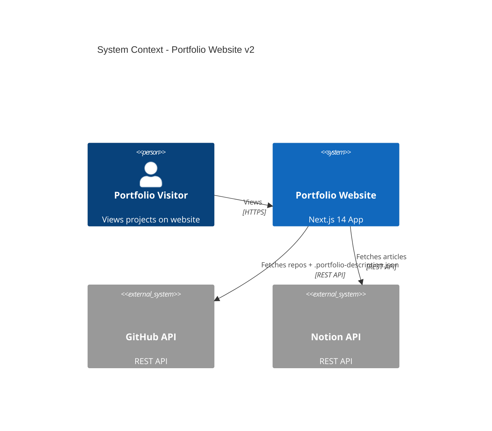
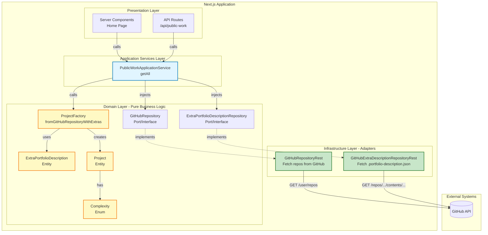
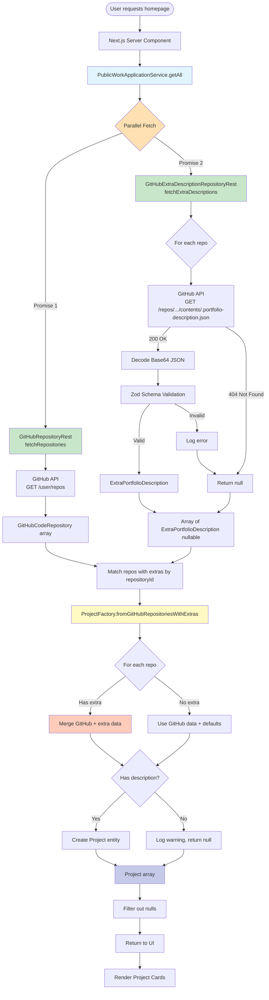
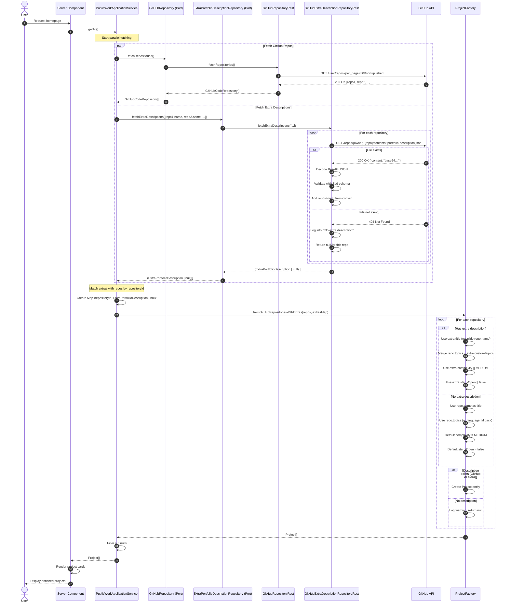
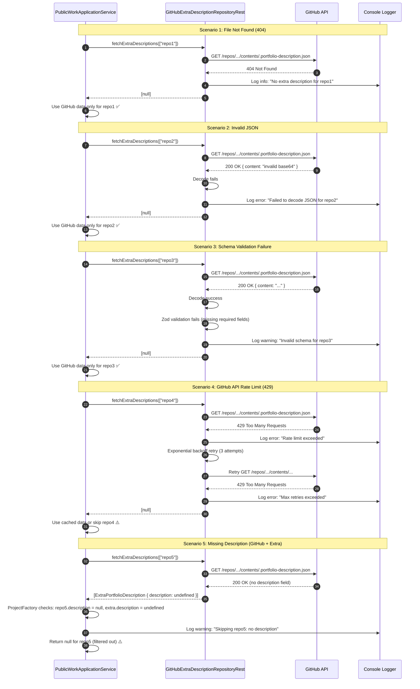
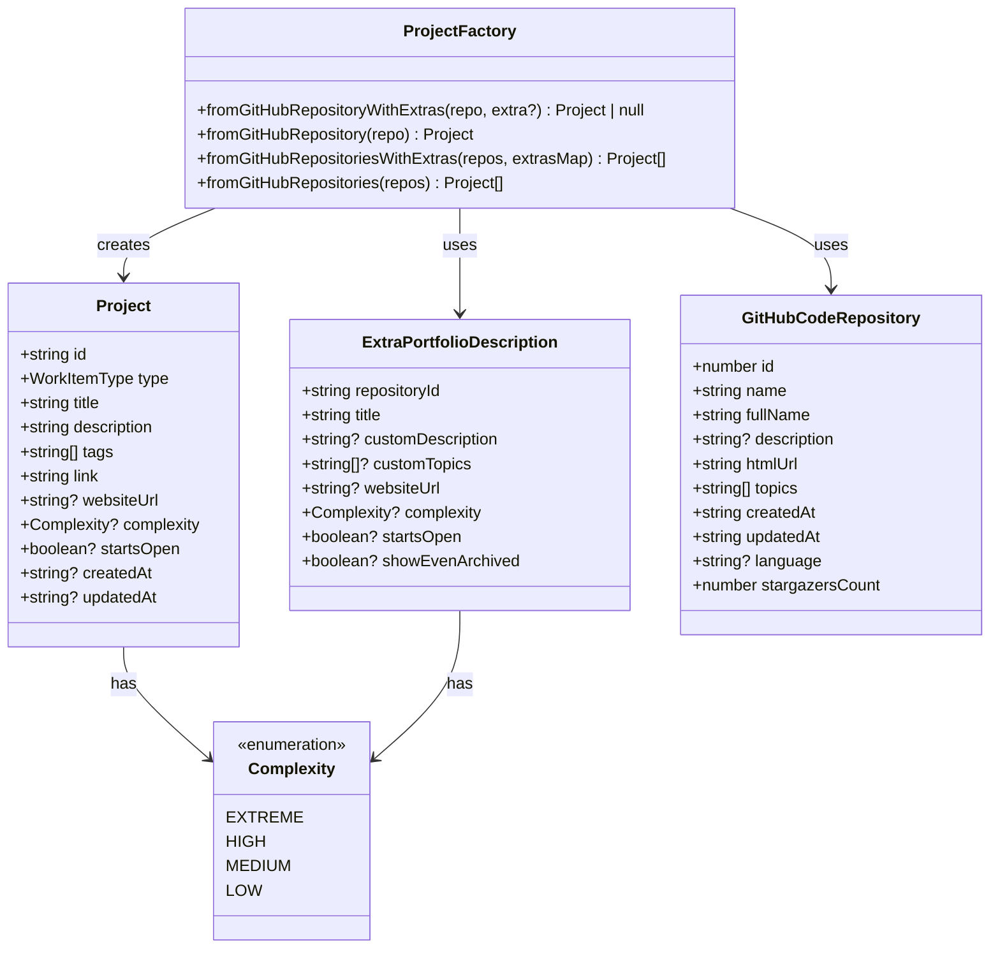
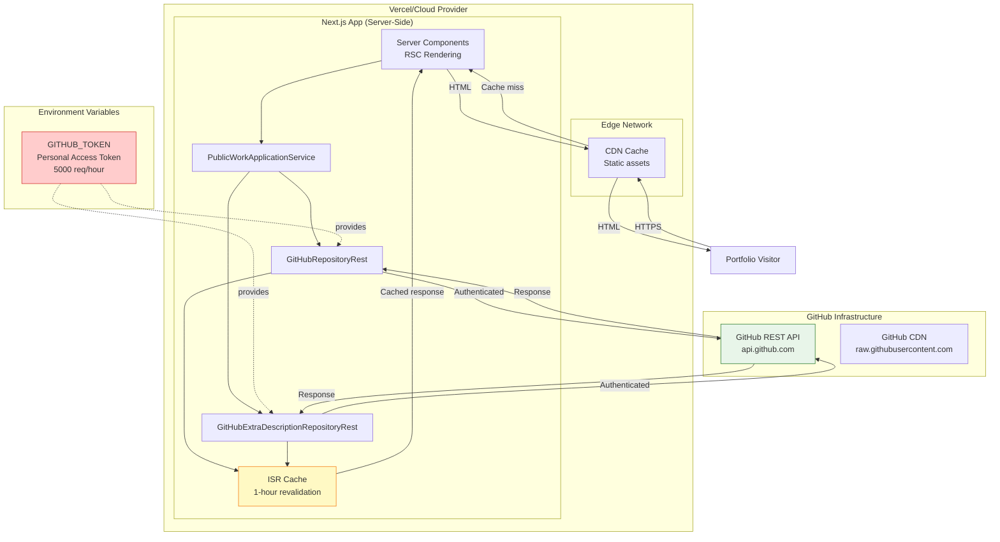
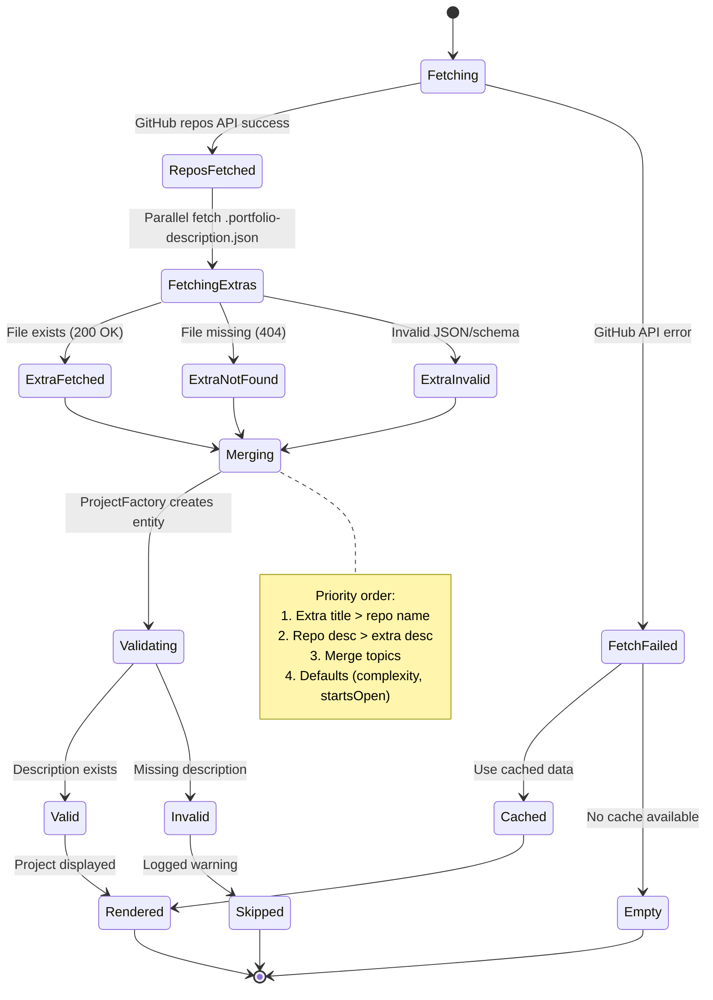

# Architecture Diagrams - GitHub Extra Descriptions Feature

This document contains visual diagrams to supplement the [ADR-2026-01-16.md](./ADR-2026-01-16.md).

---

## 1. System Context Diagram

Shows how the feature fits into the overall portfolio website architecture.



---

## 2. Container Diagram - Hexagonal Architecture

Shows the internal structure following hexagonal/ports & adapters architecture.



---

## 3. Component Diagram - Data Flow

Shows how data flows through the system from GitHub API to rendered UI.



---

## 4. Sequence Diagram - Happy Path

Detailed sequence showing successful fetch of repos + extras.



---

## 5. Sequence Diagram - Error Scenarios

Shows how the system handles various error conditions gracefully.



---

## 6. Class Diagram - Domain Model

Shows relationships between domain entities.



---

## 7. Deployment Diagram - GitHub API Integration

Shows how the Next.js app interacts with GitHub API in production.



---

## 8. State Machine - Project Lifecycle

Shows the lifecycle of a project from fetch to render.



---

## 9. Activity Diagram - Fetch & Merge Process

Shows the step-by-step process of fetching and merging project data.

```mermaid
flowchart TD
    START([PublicWorkApplicationService.getAll]) --> INIT[Initialize Promise.allSettled]

    INIT --> PARALLEL{Start Parallel Fetch}

    PARALLEL -->|Thread 1| FETCH_REPOS[Fetch GitHub Repos<br/>GET /user/repos]
    PARALLEL -->|Thread 2| FETCH_EXTRAS[Fetch Extra Descriptions<br/>For each repo]

    FETCH_REPOS --> REPOS_SUCCESS{Success?}
    REPOS_SUCCESS -->|Yes| REPOS_DATA[Store GitHubCodeRepository array]
    REPOS_SUCCESS -->|No| REPOS_EMPTY[Log error, use empty array]

    FETCH_EXTRAS --> LOOP_START{For each repo}
    LOOP_START --> FETCH_FILE[GET /repos/.../contents/.portfolio-description.json]

    FETCH_FILE --> FILE_CHECK{Response?}
    FILE_CHECK -->|200 OK| DECODE[Decode Base64 JSON]
    FILE_CHECK -->|404| NULL_1[Return null]
    FILE_CHECK -->|Other error| LOG_ERROR[Log error] --> NULL_2[Return null]

    DECODE --> VALIDATE[Zod schema validation]
    VALIDATE -->|Valid| EXTRA_DATA[ExtraPortfolioDescription]
    VALIDATE -->|Invalid| LOG_WARN[Log warning] --> NULL_3[Return null]

    EXTRA_DATA --> LOOP_END{More repos?}
    NULL_1 --> LOOP_END
    NULL_2 --> LOOP_END
    NULL_3 --> LOOP_END

    LOOP_END -->|Yes| FETCH_FILE
    LOOP_END -->|No| EXTRAS_DONE[Extras array complete]

    REPOS_DATA --> WAIT[Wait for both threads]
    REPOS_EMPTY --> WAIT
    EXTRAS_DONE --> WAIT

    WAIT --> MAP[Create Map repositoryId → ExtraPortfolioDescription | null]

    MAP --> FACTORY[Call ProjectFactory.fromGitHubRepositoriesWithExtras]

    FACTORY --> LOOP2{For each repo}

    LOOP2 --> CHECK_EXTRA{Has extra?}

    CHECK_EXTRA -->|Yes| MERGE[Merge GitHub + extra data]
    CHECK_EXTRA -->|No| DEFAULT[Use GitHub data + defaults]

    MERGE --> TITLE_MERGE[Title = extra.title]
    DEFAULT --> TITLE_DEFAULT[Title = repo.name]

    TITLE_MERGE --> DESC_CHECK{Description?}
    TITLE_DEFAULT --> DESC_CHECK

    DESC_CHECK -->|repo.description| USE_REPO_DESC[Use repo.description]
    DESC_CHECK -->|extra.customDescription| USE_EXTRA_DESC[Use extra.customDescription]
    DESC_CHECK -->|None| SKIP_PROJECT[Log warning, return null]

    USE_REPO_DESC --> TOPICS_MERGE[Merge topics: repo + extra]
    USE_EXTRA_DESC --> TOPICS_MERGE

    TOPICS_MERGE --> WEBSITE_CHECK{Website URL?}
    WEBSITE_CHECK -->|repo.homepage| USE_REPO_WEB[Use repo.homepage]
    WEBSITE_CHECK -->|extra.websiteUrl| USE_EXTRA_WEB[Use extra.websiteUrl]
    WEBSITE_CHECK -->|None| NO_WEB[websiteUrl = undefined]

    USE_REPO_WEB --> COMPLEXITY[Complexity = extra.complexity || MEDIUM]
    USE_EXTRA_WEB --> COMPLEXITY
    NO_WEB --> COMPLEXITY

    COMPLEXITY --> STARTS[StartsOpen = extra.startsOpen || false]

    STARTS --> CREATE_PROJECT[Create Project entity]

    CREATE_PROJECT --> LOOP2_END{More repos?}
    SKIP_PROJECT --> LOOP2_END

    LOOP2_END -->|Yes| LOOP2
    LOOP2_END -->|No| FILTER[Filter out nulls]

    FILTER --> RETURN[Return Project array]
    RETURN --> END([End])

    style START fill:#e1f5ff
    style FACTORY fill:#fff9c4
    style CREATE_PROJECT fill:#c8e6c9
    style SKIP_PROJECT fill:#ffccbc
    style RETURN fill:#c5cae9
```

---

## Notes

- All diagrams use **mermaid syntax** for easy rendering in Markdown viewers (GitHub, GitLab, VS Code with mermaid extension)
- Colors follow consistent scheme:
  - **Blue** (#e1f5ff): Application Service layer
  - **Yellow** (#fff9c4): Domain layer
  - **Green** (#c8e6c9): Infrastructure layer
  - **Red** (#ffccbc): Error/skip paths
  - **Purple** (#c5cae9): Final outputs

- Diagrams can be embedded directly in the ADR or viewed separately
- Tools for rendering: Mermaid Live Editor, VS Code Mermaid Preview, GitHub/GitLab native support
